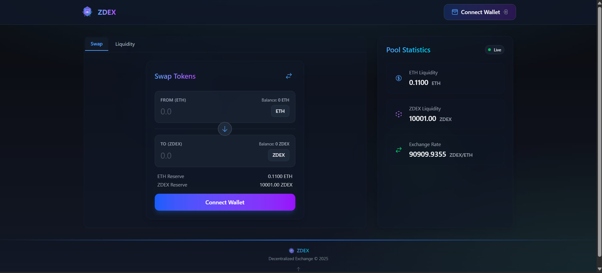
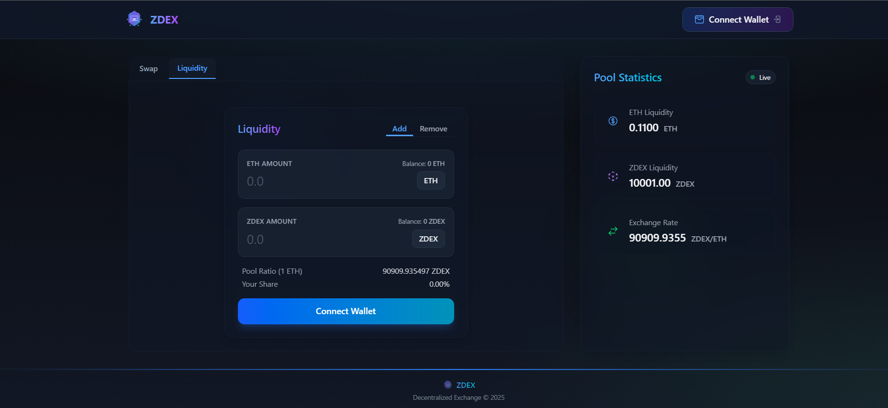
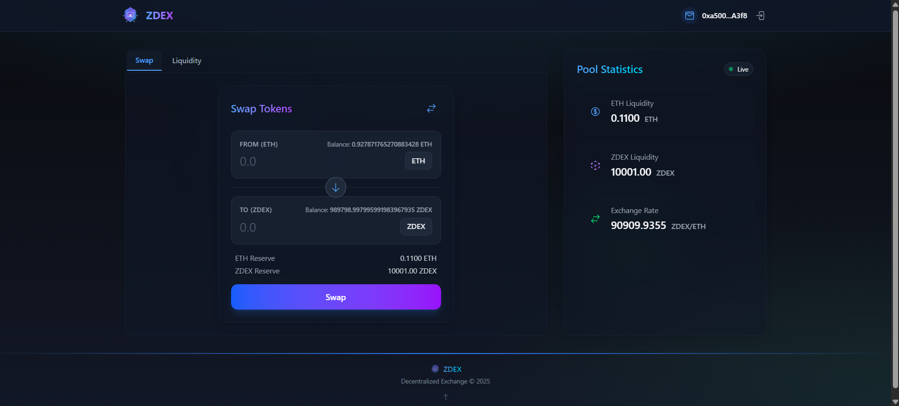
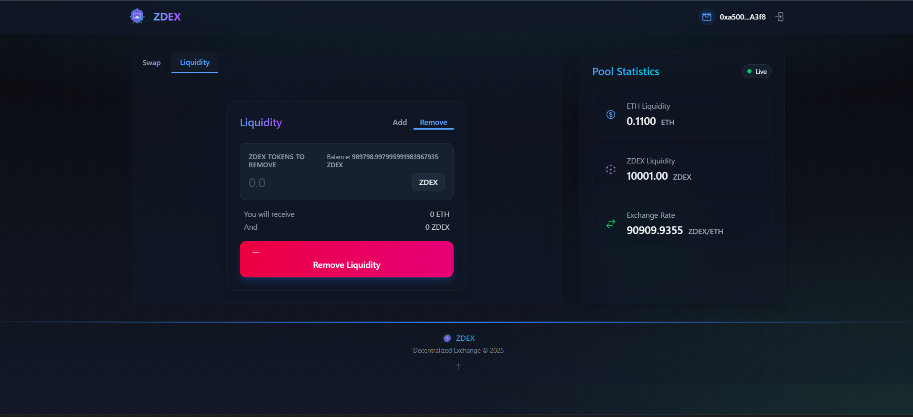

## Project Overview
- A full-featured DEX enabling ETH/ZDEX token swaps with integrated liquidity pool management for seamless trading experience. Get your ZDEX token by swapping in with ETH pool reserve.
- If you want to get the ETH back you can just reswap back to ETH using your ZDEX balance according with the exchange rate.

#### Built using React+Vite TailwindCSS FramerMotion Wagmi WalletConnect Foundry Solidity  

[Click here to visit live project](https://z-dex.vercel.app/)

## Project Screenshots
#### 1. HomeScreen when user visits and wallet is not connected 

#### 2. Add and Remove liquidity but need to connect wallet first

#### 3. You can swap ETH to ZDEX or ZDEX to ETH

#### 4. Add or Remove liquidity you have to add ETH and ZDEX according to proper calculation otherwise it will revert.
